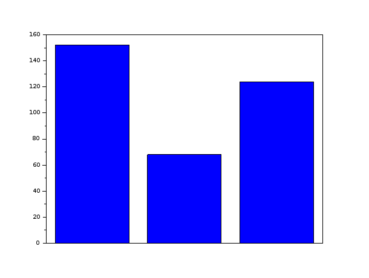
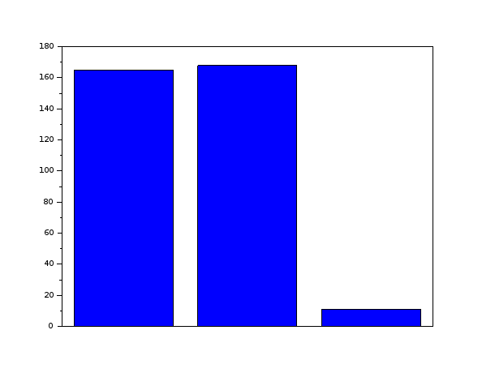
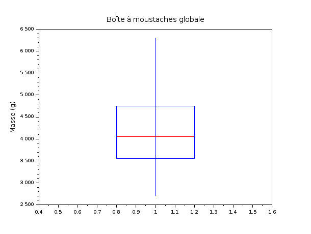
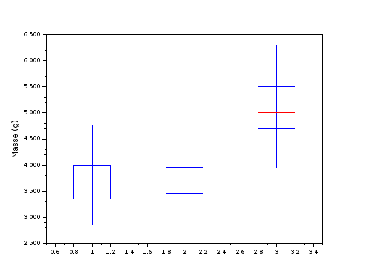
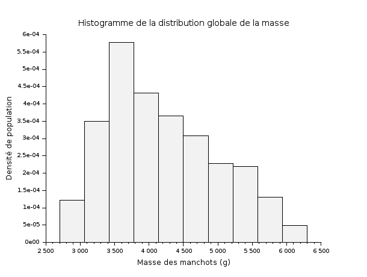
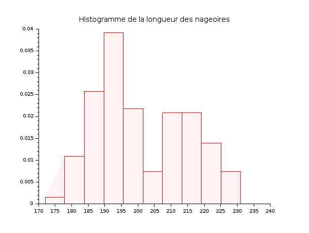
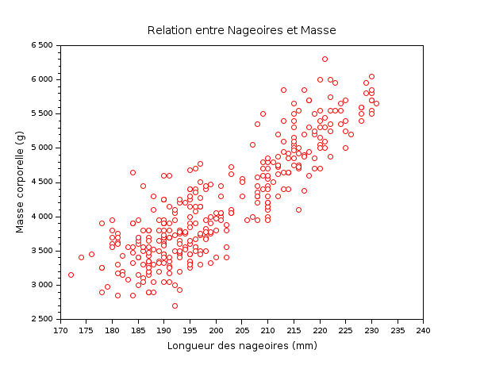

William-james Tafok
Théo Gobé

# SAÉ S2.04 (visualisation de données)

## 1) Combien de manchots sont présents dans le jeu de données ?

J'importe le fichier en mettant le chemin dans une variable

```scilab
fichier = "/home/theo/sae_s204/penguins_size.csv"
```
ensuite, j'utilise cette commande trouvé dans la doc de scilab pour importer les données en string

```scilab
data = csvRead(fichier, ",", ".", "string");
```

Pour finir, on sépare les variables **quantitatives** des variables **qualitative** dans les variables 
associé au titre des colonnes. On commence a partir de la 2eme ligne pour enlever les titre qui ne sont
pas utiles dans ce cas puisque les noms des variable les remplaces
On Remplace **NA** par **NaN** pour certaine variable car on ne peut pas tranformer sinon 

### qualitative :
```scilab
especes = data(2:$, 1);
sexe    = data(2:$, 7);
```
### quantitative : 
```scilab
longueur_bec = evstr(data(2:$, 3));
profondeur_bec = evstr(data(2:$, 4));
longueur_nageoires = evstr(data(2:$, 5));
masse = evstr(data(2:$, 6));
```

Pour répondre à la question, on regarde donc le nombre de ligne de la variable espece par exemple 
ce qui va données le nombre total de manchot en tout. La fonction size permet de calculer cela:
```scilab
NbrManchots = size(especes, 1);
NbrManchots
 NbrManchots  = 

   344.
```

**Il y a donc 344 manchots présents dans ce jeu de données.**

## 2) Quelle est la répartition des individus par espèce ?

On commence par trier les différentes espèces qui sont présente :
```scilab
especes_uniques = unique(especes);
```
Ensuite, on les répartient dans leur effectif :
```scilab
effAdelie = sum(especes == especes_uniques(1));
effChinstrap = sum(especes == especes_uniques(2));
effGentoo = sum(especes == especes_uniques(3));
```
Pour tracer le graphique de bar, on fait **la matrice 3x1 des sommes des especes :**
```scilab
effectif(1) = effAdelie
 effectif  = 

   152.

-->effectif(2) = effChinstrap
 effectif  = 

   152.
   68.

-->effectif(3) = effGentoo
 effectif  = 

   152.
   68.
   124.
```
Puis on affiche le diagramme en barres a l'aide de **la fonction bar() :**

```scilab
bar(effectif);
```



 

## 3)Quelle est la répartition des manchots selon leur sexe ?

Il y a une erreur **dans la catégorie sexe** où il y a un point. Je ne sais pas ce que cela signifie
donc j'ai arbitrairement décider de remplacer cette valeur par NA.

```scilab
sexe(sexe == ".") = "NA";

On trie les sexes :

sexes_uniques = unique(sexe);
effectifs_sexe=[];

On compte dans une variable les différents nombres d'effectif

-->for i = 1:size(sexes_uniques, "*")
-->    effectifs_sexe(i) = sum(sexe == sexes_uniques(i));
-->end

-->effectifs_sexe
 effectifs_sexe  = 

   165.
   168.
   11.

bar(effectifs_sexe);
```



## 4)Calculer la masse moyenne des manchots.

Pour la masse moyenne, on prend la variable sans les valeurs non-définis
```scilab
masse_clean = masse(~isnan(masse));

moyenne_masse = mean(masse_clean);

moyenne_masse
 moyenne_masse  = 

   4201.7544
```

La masses moyenne des manchots est donc de **4.2kg**.

## 5)Calculer :

 - La moyenne
 - La médiane
- L'écart-type

### de la masse corporelle.

Nous avions déjà calculé la masse moyenne(masse corporelle moyenne) des machots lors de la question précèdentes et nous avions trouvé le résultat suivant:

La masses moyenne des manchots est donc de 4.2kg
---
On ne trie pas les donnée par ordre croissant car d'apres la documentation de scilab la fonction mediane
le fait par défaut
```scilab
mediane_masse = median(masse_clean);

mediane_masse
 mediane_masse  = 

   4050.
```
La médianne des poids ce situe autours des 4.05kg
---
Pour l'écart type on note :
```scilab
ecart_type_masse = stdev(masse_clean);

ecart_type_masse
 ecart_type_masse  = 

   801.95454
```
L'écart type est donc de 0.8kg
---

## 6)Comparer la masse moyenne des trois espèces.

On calcule la masse moyenne pour les 3 especes ainsi que l'ecart type pour la question 7 :

```scilab
idx1 = (especes == especes_uniques(1)) & ~isnan(masse);
moy_sp1 = mean(masse(idx1));
std_sp1 = stdev(masse(idx1));


idx2 = (especes == especes_uniques(2)) & ~isnan(masse);
moy_sp2 = mean(masse(idx2));
std_sp2 = stdev(masse(idx2));

idx3 = (especes == especes_uniques(3)) & ~isnan(masse);
moy_sp3 = mean(masse(idx3));
std_sp3 = stdev(masse(idx3));

masses_moyennes    = [moy_sp1; moy_sp2; moy_sp3];
variabilites_masse = [std_sp1; std_sp2; std_sp3];

>masses_moyennes
 masses_moyennes  = 

   3700.6623
   3733.0882
   5076.0163
```

- L'èspeces de manchot  Adélie à une masse moyenne de **3.70kg**.

- L'èspeces de manchot  Chinstrap à une masse moyenne de **3.73kg**.

- L'èspeces de manchot  Gentoo à une masse moyenne de **5.08kg**.

On peut voir que **les manchot Gentoo sont en moyenne plus lourd de 2kg que ses semblales (Adéline et Chrinstrap)** qui n'ont qu'une diffèrences de 0.03kg entre eux.

## 7)Quelle espèce présente la plus forte variabilité de masse ?
Il manque la fonction que ta utiliser pour calculer ça
```scilab
 variabilites_masse  = 

   458.56613
   384.33508
   504.11624
```

C'est donc l'espèce Gentoo qui possede la plus forte variabilité soit le plus grand écart de poid, **504g** contre **458g pour l'espèce Adéline** et **384g pour l'espèce Chinstrap**.


## 8)Déterminer les quartiles Q1, Q2 et Q3 de la masse corporelle.

Pour determiner **les quartiles**, on doit trié les tableau par ordre croissant

```scilab
masse_triee = gsort(masse_clean, 'g', 'i');
N_clean = length(masse_clean);
```

On utilise la fonction **ceil()** qui arrondie au supérieur.
```scilab
Q1 = masse_triee(ceil(N_clean * 0.25));
Q2 = median(masse_clean); Q2 est évidemment la médianne donc autant utiliser la fonction médianne
Q3 = masse_triee(ceil(N_clean * 0.75));


 Q1  = 

   3550.
 Q2  = 

   4050.
 Q3  = 

   4750.
```
### Les quartiles de la masse corporelle  sont donc égales a : 
- Q1 = 3.55kg
- Q2 = 4.05kg
- Q3 = 4.75kg

En déductions **25% des manchots pèsent moins de 3.55kg**, **la moitié pèsent moins de 4.05kg et 75% pèsent moins de 4.75kg**

## 9)Calculer l'écart interquartile.


Pour calculer l'écart interquartile, Il suffit juste de faire une diffèrence entre les 2 quartile intéressant.
c'est a dire **Q1 et Q3** car Q2 est juste la médiane.

```scilab
ecart_iqr = Q3 - Q1;

 ecart_iqr  = 

   1200.
```
On peut donc en conclure que 50% des manchots situés au centre de notre échantillon (Q1-Q3) ont **une diffèrence de poids maximale de 1.2kg** entre eux. 


## 10) Construire une boîte à moustaches de la masse corporelle.



## 11) Comparer les boîtes à moustaches des masses selon l'espèce.



## 12)Construire un histogramme de la masse corporelle.

On utilise hisplot



## 13)Déterminer :

- la classe modale
- la fréquence de chaque classe

### calcule des bornes :
```scilab
bornes = linspace(min(masse_clean), max(masse_clean), n_bins + 1);
```

### On utilise **dsearch()** qui permet de ranger les manchots dans les tranches de poids qu' on a defini :

```scilab
[ind, counts] = dsearch(masse_clean, bornes);

Pour trouver la classe modale, on cherche donc le maximum

[max_c, id_mod] = max(counts);

Classe modale = [3420 ; 3780]
```

### Pour **les fréquences**, on divise juste la proportion de la borne par la proportion total :
```scilab
for k = 1:n_bins
-->    freq(k) = counts(k) / size(masse_clean, "*");
-->end

-->freq
 freq  = 

   0.0438596
   0.1257310
   0.2076023
   0.1549708
   0.1315789
   0.1111111
   0.0818713
   0.0789474
   0.0467836
   0.0175439
```
### Avec **disp()**, on peut obtenir un meilleur affichage :
```scilab
 "Classe [2700 ; 3060] -> Freq : 0.0438596"

  "Classe [3060 ; 3420] -> Freq : 0.125731"

  "Classe [3420 ; 3780] -> Freq : 0.2076023"

  "Classe [3780 ; 4140] -> Freq : 0.1549708"

  "Classe [4140 ; 4500] -> Freq : 0.1315789"

  "Classe [4500 ; 4860] -> Freq : 0.1111111"

  "Classe [4860 ; 5220] -> Freq : 0.0818713"

  "Classe [5220 ; 5580] -> Freq : 0.0789474"

  "Classe [5580 ; 5940] -> Freq : 0.0467836"

  "Classe [5940 ; 6300] -> Freq : 0.0175439"
```
Les resultat trouver nous montre que la classe modale se situe entre **3.42kg et 3.78kg [3420;3780](en grammes)**. C'est la tranche de poids la plus représentée,regroupant **environ 20.8%** (fréquence = 0.2076023) des manchots de l'échantillon.
## 14) Construire un histogramme de la longueur des nageoires.




## 15)Tracer un nuage de points :

- longueur des nageoires
- masse corporelle
Observe-t-on une relation entre ces deux variables ?

On place en **abcisse la longueur des nageoire** et **en ordonnée la masse**.



On remarque qu' il y a **une corrélation positive forte et linéaire**. On peut en déduire que le coéfficient
de corrélation est très proche de 1.

## 16)Calculer le coefficient de corrélation linéaire de Pearson entre :

- masse corporelle
- longueur des nageoires

Pour calculer le coefficient, on peut utiliser la fonction scilab **correl()** :
```scilab
r_nag_masse = correl(X_nag(:)', Y_masse(:)');

r_nag_masse
 r_nag_masse  = 

   0.8712018
```
On remarque qu' il est proche de 1 d'où le nuage de point précédent .

## 17)Calculer la corrélation entre :

longueur du bec profondeur du bec

On retire **les valeur non-affectées** et on fait la correlation :

```scilab
ok_bec = ~isnan(longueur_bec) & ~isnan(profondeur_bec);
r_becs = correl(longueur_bec(ok_bec)', profondeur_bec(ok_bec)');

r_becs
 r_becs  = 

  -0.2350529
```
La corrélation obtenue est de **-0.235**.Sachant que ce dernier est proche de 0 on peut donc en conclure **qu'il n'y a pas de lien de proportion fort entre ces deux mesures**. Entre autre avoir un bec plus long ne signifie pas forcément avoir un bec plus profond.


## 18) On cherche à prédire la masse corporelle à partir de la longueur des nageoires.

Déterminer l'équation de la droite de régression :

Pour la **droite de régression** on fait comme dans les tp scilab vu en cours avec **reglin()** :
```scilab
[a, b, sig] = reglin(X_nag(:)', Y_masse(:)');

a  = 

   49.685566

 b  = 

  -5780.8314
```
donc on a une équation y = 49.685566 * nageoire - 5780.8314

## 20)Calculer le coefficient de détermination R^2

Pour le coefficient de détermination, c'est la correlation des nageoires et des masses au carré:

```scilab
R2 = r_nag_masse^2;

-->R2
 R2  = 

   0.7589925
```
## 21) À l'aide du modèle obtenu, estimer la masse d'un manchot dont les nageoires mesurent 210 mm.

On remplace nageoire dans l'équation précédente par la longeur ou l'on veut déterminer la masse : 
```scilab
pred_210 = a * 210 + b;

-->pred_210
 pred_210  = 

   4653.1376
```
Donc un manchot ayant une nageoire de 210 mm aura une masse qui tournera autour de 4653.1376. Selon le 
coefficient de determination, cette aproximation est assez proche.


## 22) Construire une droite de régression pour chaque espèce.

Comparer :

- les pentes
- les coefficients de corrélation

On utilise une boucle :
```scilab
for i = 1:size(especes_uniques, "*")
    idx_sp = (especes == especes_uniques(i)) & ok_biv;
    if sum(idx_sp) > 1 then
        X_sp = longueur_nageoires(idx_sp)';
        Y_sp = masse(idx_sp)';
        [a_sp, b_sp, s_sp] = reglin(X_sp, Y_sp);
        r_sp = correl(X_sp, Y_sp);
        disp(especes_uniques(i) + " -> Pente (a) = " + string(a_sp) + " | Corrélation (r) = " + string(r_sp));
    end
end
```

### On obtient donc les pentes et le coef de correlation pour les 3 espèces :

  - "Adelie -> Pente (a) = 32.83169 | Corrélation (r) = 0.4682017"

  - "Chinstrap -> Pente (a) = 34.573394 | Corrélation (r) = 0.6415594"

  - "Gentoo -> Pente (a) = 54.622502 | Corrélation (r) = 0.7026665"


## 23) Les mâles sont-ils en moyenne plus lourds que les femelles ?

Comparer :

- moyenne
- médiane
- écart-type

### On fait pareil que les questions précédentes mais pour les sexes féminin et masculin :

```scilab
idx_sx1 = (sexe == sexes_uniques(1)) & ~isnan(masse);
moy_females = mean(masse(idx_sx1));
med_females = median(masse(idx_sx1));
std_females = stdev(masse(idx_sx1));

idx_sx2 = (sexe == sexes_uniques(2)) & ~isnan(masse);
moy_males = mean(masse(idx_sx2));
med_males = median(masse(idx_sx2));
std_males = stdev(masse(idx_sx2));

idx_sx3 = (sexe == sexes_uniques(3)) & ~isnan(masse);
moy_NA = mean(masse(idx_sx3));
med_NA = median(masse(idx_sx3));
std_NA = stdev(masse(idx_sx3));
```

### On fait une matrice qui concentre tout les résultats par soucis de simpliciter  :
```scilab
stats_sexe = [moy_females, med_females, std_females;
              moy_males,   med_males,   std_males;
              moy_NA,      med_NA,      std_NA];

-->stats_sexe
 stats_sexe  = 

   3862.2727   3650.   666.17205
   4545.6845   4300.   787.62888
   4005.5556   4100.   679.35836
```
On remarque donc que les mâles sont en moyenne plus lourds que les femelles. 


## 24) Quelle variable est la plus fortement corrélée à la masse corporelle ?

Comparer :

- longueur du bec
- profondeur du bec
- longueur des nageoires

### On enleve les NaN 
```scilab
ok_becL_masse = ~isnan(longueur_bec) & ~isnan(masse);
ok_becP_masse = ~isnan(profondeur_bec) & ~isnan(masse);
ok_nag_masse  = ~isnan(longueur_nageoires) & ~isnan(masse);
```
### On calcule les differentes correlation linéaire :
```scilab
r_bec_longueur   = correl(longueur_bec(ok_becL_masse)', masse(ok_becL_masse)');
r_bec_profondeur = correl(profondeur_bec(ok_becP_masse)', masse(ok_becP_masse)');
r_nageoires      = correl(longueur_nageoires(ok_nag_masse)', masse(ok_nag_masse)');
```
### Pour finir, on stock les valeurs absolue des différentes corrélation :
```scilab
corr_globales_masse = [abs(r_bec_longueur); abs(r_bec_profondeur); abs(r_nageoires)];

-->corr_globales_masse
 corr_globales_masse  = 

   0.5951098
   0.4719156
   0.8712018
```
On peut voir que le facteur le plus prédicteur du poid est **la longueur des nageoire largement avec un 
coefficient a 0.87**
Ensuite, c'est la longueur du bec et enfin en dernier la profondeur du bec.
